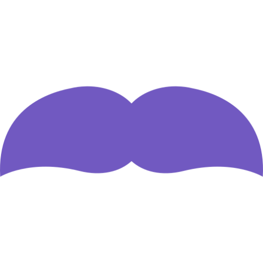

<h1 align="center">
   
  GoBarber
</h1>

## Backend
### Instalando todas as dependências
Rode o comando "yarn".

### Executando API e Fila
Rode o comando "yarn dev" e "yarn queue".

### Testando os comandos
Importe o arquivo no Insomnia clicando <a href=".github/insomnia.json">aqui</a>.

## Frontend
### Instalando todas as dependências
Rode o comando "yarn".

### Executando a aplicação
Rode o comando "yarn start".

## Mobile
Em breve.

